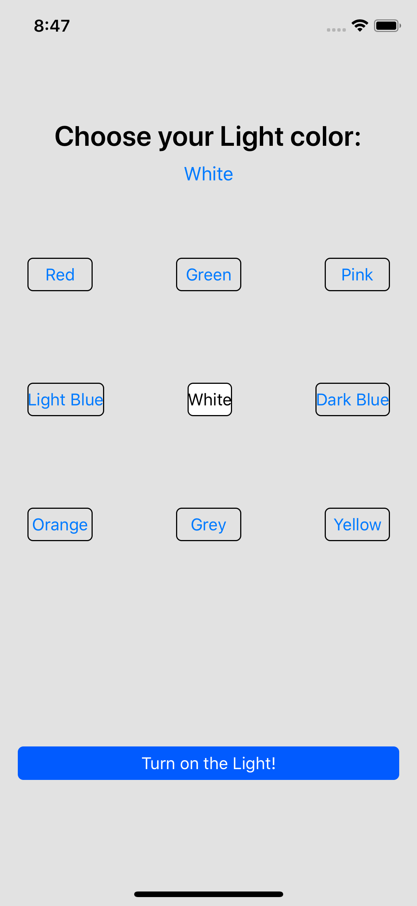
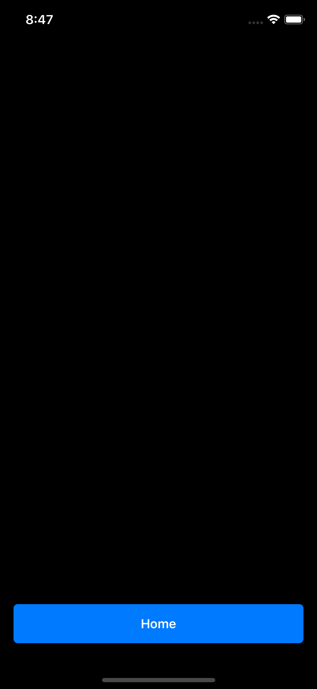
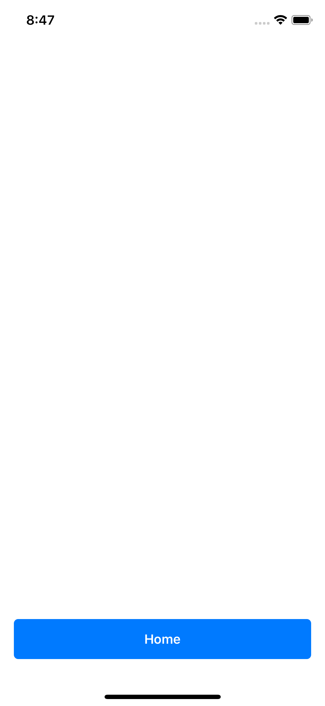

# Light

### First, the user can choose a color for their light

### Second, the user pushes the "Turn on the Light!" button and gets to a black screen

### Third, when the user taps the screen, it goes from black to the chosen color and backward
<kbd></kbd>

## Features Initial Version
### - The user can tap the screen to go from white to black and backwards

##  Features Updated Version
### - The user can choose a color
### - The user can go back and choose another color
### - The status bar turns to dark mode, if the chosen color is a light color
### - The status bar turns to light mode, if the chosen color is a dark color
